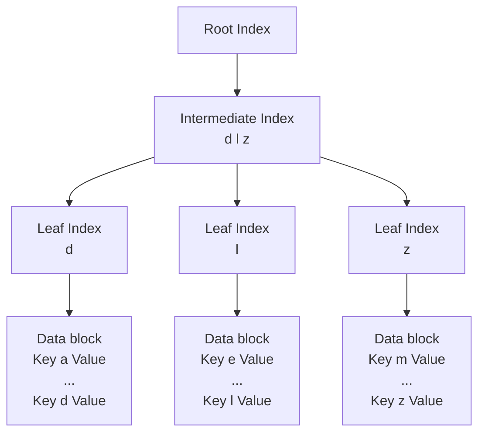

# HBase

HBase 是一种类似于数据库的存储层，适用于结构化的存储，是一种列式的分布式数据库。HBase适合用来进行大数据的实时查询，ACID只支持单个Row级别。

## HBase 与 RDBMS的区别

### 表1. 数据在RDBMS中的排布示例:

| ID   | fn   | ln   | passwd | timestamp |
| ---- | ---- | ---- | ------ | --------- |
| 1    | 三   | 张   | 111    | 20160719  |
| 2    | 四   | 李   | 222    | 20160720  |

### 表2. 数据在HBase中的排布(逻辑上)

HBase 有Column Family的概念, 简称为CF. CF一般用于将相关的列(Column) 组合起来.  将表1中的列分成两个CF, 分别为info 和 pwd. info存储着姓名相关列的数据, 而pwd则是密码相关的数据. 

| Row-key | Value(CF, Qualifier,Version)                         |
| ------- | ---------------------------------------------------- |
| 1       | info{'fn':'三', 'ln':'张'}  pwd{'passwd':'111'} |
| 2       | info{'fn':'四', 'ln':'李'} pwd{'passwd':'222'}  |

###  数据在HBase中的排布(物理上)

在物理上HBase是按CF存储的, 只是按照Row-key将相关CF中的列关联起来.

#### 表3. info 列族

| Row-Key | CF:Column-Key | 时间戳    | Cell Value |
| ------- | ------------- | --------- | ---------- |
| 1       | info:fn       | 123456789 | 三         |
| 1       | info:ln       | 123456789 | 张         |
| 2       | info:fn       | 123456789 | 四         |
| 2       | info:ln       | 123456789 | 李         |

表3 是info存储在HBase中的数据排布, 表中的fn和ln为 Column-key 或者 Qulifimer. 在HBase中, Row-key + CF + Qulifier + 时间戳才可以定位到一个单元格数据(HBase 中每个单元格默认有3个时间戳的版本数据). 

#### 表4 pwd列族

| Row-Key | CF:Column-Key | 时间戳    | Cell Value |
| ------- | ------------- | --------- | ---------- |
| 1       | pwd:passwd    | 123456789 | 111        |
| 2       | pwd:passwd    | 123456789 | 222        |

 从表3和表4可以看到, Row1到Row2的数据分布在两个CF中, 并且每个CF对应一个HFile。RDBMS逻辑上每一行中的一个单元格数据，对应于HFile中的一行，然后当用户按照Row-key查询数据的时候，HBase会遍历两个HFile，通过相同的Row-key标识，将相关的单元格组织成行返回。

## HBase 相关模块

在HBase 的集群中主要由Master 和 Region Server 组成，以及Zookeeper。

### HBase Master

HBase Master 用于协调多个Region Server，侦测各个region server 之间的状态，并平衡region server 之间的负载。

hbase master负责分配region 给region server。

### Region Server

一个Region server 包括了多个region，region server 的作用只是管理表格，以及实现读写操作。client 直连region server， 并通信获取hbase 中的数据。region 是真实存放hbase数据的地方，是hbase可用性和分布式的基本单元。

当一个表很大，并由多个CF组成时，那么表的数据将存放在多个region之间，并在每个region中会关联多个存储单元（store）。

### Zookeeper

Zookeeper 是作为HBase Master 的HA解决方案。负责region 和region server 的注册。

## HBase 的工作原理

有一个名为META表的特殊HBase Catalog表，它保存集群中区域的位置。ZooKeeper存储META表的位置。client第一次读写HBase 数据时，client从ZooKeeper获取持有META表的region server，向.META. server 查询相应的row key 所在的region server，向region server 获取数据。

#### .META table location is stored in Zookeeper

### HBase Meta Table

META 表 用于定位指定key的Region。

1.  META 表是一个保存了系统所有regions列表的HBase 表。
2.  META 表类似B 树。
3.  META 表的结构Row key + Value。
4.  Row key： table + key + region。
5.  Value：region server。

### Region Server 组件

Region Server 在HDFS DataNote 上运行，包括以下组件：

1. WAL： Write Ahead Log 是HDFS上的文件，它用于保存数据操作记录，并用于操作重放。
2. BlockCache：数据读缓存，在内存中保存了高频读数据。
3. MemStore：数据写缓存，它存储还没有被落盘的新数据，在落盘前将数据排序，每一个region每个CF有一个MemStore。
4. HFiles 将KeyValues排序后储存在磁盘。

##### region 

每个region中一个CF由一个Store服务,  一个 region 可以包含多个Store. 每个Store由一个MemStore 和 0 个或者多个HFile组成. 

#### HBase Write 操作 

1. 当client发出put 请求时，第一步是将Edits写入预写日志WAL。
2. 数据更新被写入Memstore，并返回client结果。

#### HBase MemStore

MemStore将更新作为已排序的KeyValues存储在内存中，与存储在HFile 中的更新相同。每个CF有一个MemStore，更新按CF排序。

#### HBase Region Flush

当MemStore 积累足够数据时，整个有序集合被写入HDFS中新的HFile。一个CF包括多个HFiles，HFile在MemStore 将数据落盘时被创建。最大的写序列号被保存在HFile中。

最小的flush 单元是region, 当一个MemStore 达到 hbase.hregion.memstore.flush.size 时, 同个region 所有的MemStore 将flush 到磁盘.

#### HBase HFile

数据作为已排序的KeyValues存储在HFile 中，顺序写入磁盘。

#### HBase HFile 结构

一个HFIle 包括多层索引，以避免读整个文件来定位数据。

1. 键值对按递增顺序存储在数据块（64kb）中。
2. 索引按行键指向64KB“块”中的键值数据。
3. 每一个块有自己的leaf-index。
4. 每一个块最后一个key被保存到intermediate index。
5. root index 指向intermediate index。

Trailer 指向元数据块，被写入持久化数据文件的结尾处。Trailer 包含bloom filters和 time range info。bloom 过滤器有助于跳过不含确定某个Row-key的文件。time range info有助于跳过不在查询时间范围内的文件。

|                               |
| ----------------------------- |
| Key a Value (64 KB)  ... |
| Leaf Index                    |
| Bloom                         |
| Key z Value (64 KB) ...  |
| Leaf Index                    |
| Bloom                         |
| Intermediate Index            |
| Root Index                    |
| Bloom                         |
| Trailer                       |

#### HFile Index

前面提及的索引信息在HFile被打开的时候存入内存（BlockCache），索引信息允许使用单个磁盘搜索执行查找。

#### HBase Read Merge

一行数据可能存储在多个地方，包括持久化到HFile、最近在MemStore中执行更新操作、最近读到BlockCache中。因此，当读取一行数据时，读取操作将来自BlockCache（读缓存）、MemStore(写缓存)、以及HFile（持久化数据文件）的 Key Values 合并。

##### Read Amplification

一个MemStore可能有多个HFile，因此每次读操作，可能因需要检查多个文件而影响性能。这就是读操作放大。

#### HBase Minor Compaction （压实）

HBase自动选择一些小的HFile，将它们重写到更少的更大的HFile。这个进程叫Minor Compaction。

#### HBase  Major Compaction

主压实合并一个region中相同CF的所有的HFile并重写到一个HFile中。这个进程将删除已经删除或者过时的记录。

#### Region = Contiguous Keys(相邻的Keys)

1. 表可以水平划分为一个或多个区域。 区域包含开始键和结束键之间的连续排序行范围。
2. 一个Region 默认1G。
3. 一个Region 通过 Region Server 为clinet 服务。
4. 一个Region Server 可以服务1000个Region（属于同一个表或者不同的表）。

#### Region Split

每个表初始化时都有一个Region。当Region增长到很大时，它会分解为两个子Region，每个子Region包含父Region一半的数据，在Region Server 中并行打开，分解的结果会被报告给HMaster。出于负载平衡，HMaster可以安排将新区域移到其他服务器。

#### HDFS  Data Replication

HDFS 复制WAL和HFIle 块。HFile块复制自动发生。HBase依赖HDFS在存储文件时提供数据安全性。

#### HBase Crash Recovery

当某个RegionServer 宕机时，Zookeeper丢失来自它的心跳，HMaster将被通知这个信息。HMaster 重新分配已经宕机的RegionServer 上 的region给活着的RegionServer。新的RegionServer将恢复宕机RegionServer MemStore 中未持久化的更新操作。HMaster 将属于宕机RegionServer 的 WAL分割成多个文件并存储到这些新的RegionServer的DataNode中。每个新的RegionServer 将重放WAL以重建Region 的 MemStore。

#### HBase 强一致性

HBase 使用多版本并发控制(MVCC)来保证强一致性.

##### 对于写操作

1. 获取行锁;
2. 申请新的写序号;
3. 写WAL;
4. 更新MemStore, 将数据内容和写序号更新到MemStore;
5. 结束写序列号;
6. 释放行锁.

##### 对于读操作

1. 每个读操作都被分配一个时间戳, 称为读取点;
2. 读取点被指定为最高整数, 以便写入序号 <= x 的所有写入都已经完成;
3. 一个对特定(row, column)的查询, 返回的匹配(row, column)数据所携带的写序号必须是最大的并且小于读点.